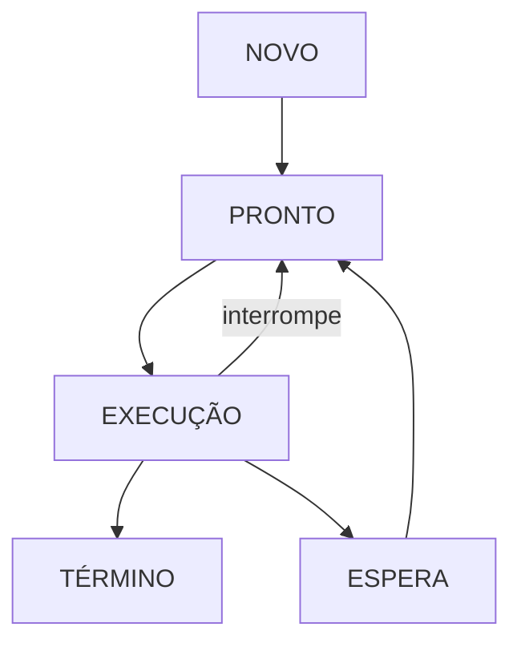

# **Políticas de Escalonamento**

1 - **FIFO ou FCFS (não preemptivo)** -> escalona o 1º processo que chega na fila de prontos)

2 - **SJF (ótimo)** -> escalona o processo de menor ciclo de CPU, por 1º
não-preemptivo
preemptivo: interrompe a execução se chegar um processo menor

3 - **Prioridade** -> PCB ou descritor: tem a prioridade do processo 

---

| Processo | Instante Chegada | Ciclo CPU | Prioridade | Tempo de Espera | Tempo de Retorno | Espera (Preemptivo) | Retorno (Preemptivo) |
|----------|------------------|-----------|------------|------------------|--------------------|----------------------|-----------------------|
| P1       | 0                | 3         | 4          | 0                | 3                  | 7                    | 10                     |
| P2       | 1                | 4         | 0          | 2                | 6                  | 0                    | 4                     |
| P3       | 2                | 2         | 0          | 5                | 7                  | 3                    | 5                     |
| P4       | 3                | 1         | 1          | 6                | 7                  | 4                    | 4                     |

---

+ **TME (Tempo Médio de Espera)** -> 3,25 (Não Preemptivo)

+ **TMR (Tempo Médio de Retorno)** -> 7,75 ((Não Preemptivo)

+ **TME (Tempo Médio de Espera)** -> 3,5 (Preemptivo)

+ **TMR (Tempo Médio de Retorno)** -> 5,75 ((Preemptivo)

---

# Escalonamento por Prioridade

## Prioridade **Não-Preemptivo**

| Processo | Tempo de Chegada |
|----------|------------------|
| P1       | 0                |
| P2       | 3                |
| P3       | 7                |
| P4       | 9                |

## Prioridade **Preemptivo**

| Processo | Tempo de Chegada |
|----------|------------------|
| P1       | 0                |
| P2       | 1                |
| P3       | 5                |
| P4       | 7                |
| P1       | 8 (Reinício ou Interrupção) |

##

+ **Prolema**: Espera indefinida, starvation ou postergação indefinida

+ **Solução**: Técnica de Envelhecimento (aging)    

##

# Ciclo de Vida de um Processo

Representação dos estados de um processo:

---

4 - **Round-Robin, Revezamento Circular ou Fatia de Tempo (RR)** :
+ somente preemptivo 
+ quantum (q) = fatia de tempo
+ fila está organizada em ordem de chegada

#

### **RR q = 2**

#

| Processo | P1 | P2 | P3 | P4 | P1 | P2 |
|----------|----|----|----|----|----|----|
| Tempo    | 0  | 2  | 4  | 6  | 7  | 10 |

#

| Processo | Instante Chegada | Ciclo CPU | Prioridade | Tempo de Espera | Tempo de Processo |
|----------|------------------|-----------|------------|------------------|--------------------|
| P1       | 0                | 3 conclui 1         | 4          | 5                | 8                  |
| P2       | 1                | 4 conclui 2        | 0          | 1+4=5                | 9                  |
| P3       | 2                | 2 conclui        | 0          | 2                | 4                  |
| P4       | 3                | 1 conclui        | 1          | 3                | 4                  |

#

+ **TME (Tempo Médio de Espera)** -> 3,75

+ **TMR (Tempo Médio de Retorno)** -> 6,25

